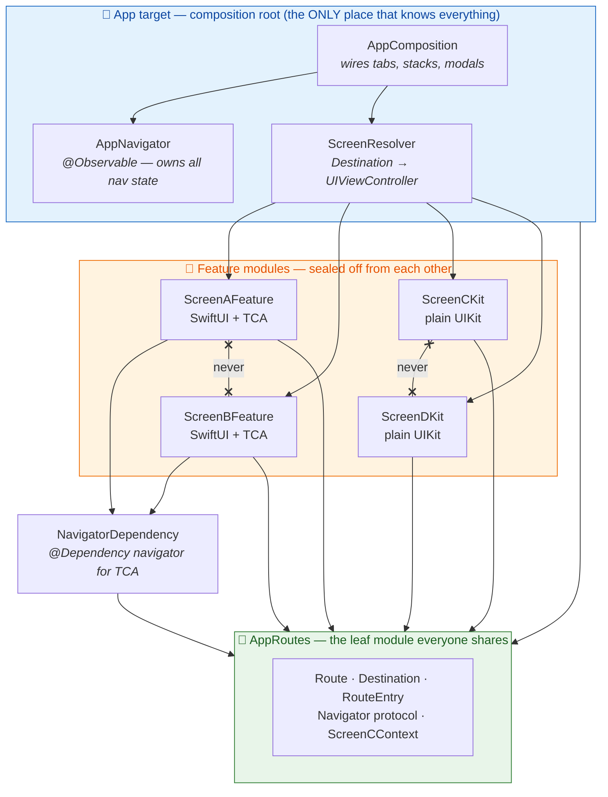
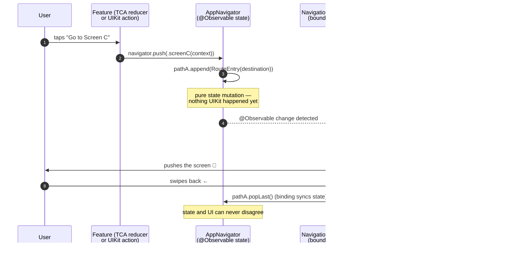
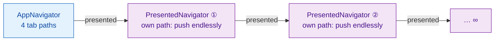
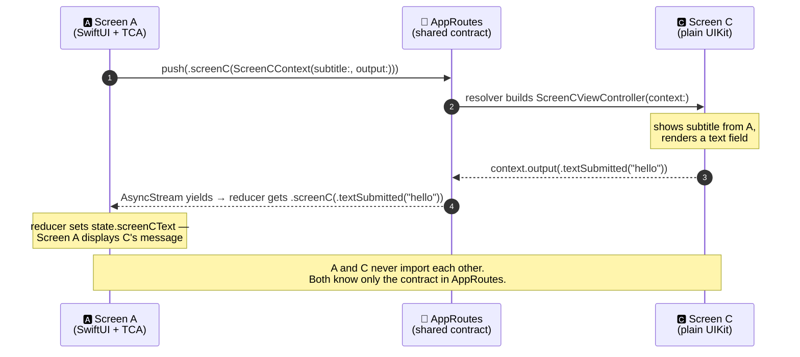

<div align="center">

# 🧭 SwiftNavigator

### State-driven navigation for a hybrid SwiftUI + TCA + UIKit app — with hard module boundaries

[](https://swift.org)
[](https://developer.apple.com)
[](https://github.com/pointfreeco/swift-composable-architecture)
[](https://github.com/pointfreeco/swift-navigation)
[](#-the-four-screens)

*One `Navigator`, one screen catalog, zero screen-to-screen imports.*

</div>

---

## 🎯 What this POC proves

This project is a proof of concept for a single question: **can one state-driven navigation system drive an entire hybrid app** — SwiftUI + TCA screens and plain UIKit screens living side by side — **without any screen ever knowing another screen exists?**

It demonstrates, end to end:

| ✅ | Capability |
|---|---|
| **State-driven navigation** | Every push, pop, and modal is a plain value in an `@Observable` model. Mutate the state → the UI follows. Swipe back / dismiss → the state syncs back. No imperative `pushViewController` calls from features. |
| **SwiftUI + TCA screens** | Screens A & B are SwiftUI views driven by Composable Architecture reducers, hosted in `UIHostingController`s. |
| **Plain UIKit screens** | Screens C & D are hand-rolled `UIViewController`s — no TCA, no SwiftUI, no `@Dependency`. They get the `Navigator` through their initializer. |
| **Endless pushes** | Any screen can push any screen, in any order, forever — including the same screen multiple times on one stack (`A → C → A → C → …`). |
| **Endless presents** | Any screen can present any screen modally; each modal gets its **own navigation stack**, and modals can present more modals, recursively, with no depth limit. |
| **Passing data forward** | A caller attaches a typed payload (`ScreenCContext`) to the destination it pushes — no global state, no side channels. |
| **Passing data back** | The pushed screen reports events back through a closure in that payload (`ScreenCOutput`) — the delegate pattern, without either module importing the other. |
| **Hard domain boundaries** | Screen A does not know Screen B. No feature imports another feature. They all know exactly one thing: the shared **routes** module. |

---

## 🧩 The four screens

The app is a `UITabBarController` with four tabs. Every screen shows "Go to …" / "Present …" buttons for every *other* screen — generated from `Route.allCases`, which is what makes the "endless navigation" claim testable by hand.

| Tab | Screen | Built with | Navigation style |
|-----|--------|-----------|------------------|
| 🅰️ | **Screen A** (+ in-module child **A2**) | SwiftUI + TCA `@Reducer` | Cross-module via `Navigator`, in-module child via `@Presents` / `.ifLet` |
| 🅱️ | **Screen B** (+ in-module child **B2**) | SwiftUI + TCA `@Reducer` | Same as A — proves the pattern repeats |
| 🅲 | **Screen C** (+ **C2**) | Plain UIKit | `Navigator` injected via `init` — and the star of the [data passing demo](#-passing-data-forward-and-back) |
| 🅳 | **Screen D** (+ **D2**) | Plain UIKit | Same as C |

---

## 🏗 Architecture at a glance

Everything lives in a local Swift package (`MyLibrary`) of small, single-purpose targets, plus a thin app target that acts as the **composition root** — the only place where all the pieces are allowed to meet.



**Read the arrows carefully — the ones that *don't* exist are the point:**

- ❌ `ScreenAFeature` never imports `ScreenBFeature`, `ScreenCKit`, or `ScreenDKit` (and vice versa, for every pair).
- ❌ No feature imports the resolver, the navigator implementation, or the app target.
- ✅ Every feature imports exactly one shared thing: **`AppRoutes`** — a tiny leaf module of value types and one protocol.
- ✅ Only the **composition root** imports the features, because someone has to actually build the screens.

> 💡 Screens communicate by *describing where they want to go* (`Destination`) and *what they want to say* (`ScreenCContext` / `ScreenCOutput`) — never by touching each other.

---

## 📦 The vocabulary: `Route` vs `Destination` vs `RouteEntry`

Three small types share the work that one type couldn't do alone:

| Type | What it is | Why it exists |
|------|-----------|---------------|
| **`Route`** | Stateless catalog of every screen: `.screenA`, `.screenB`, `.screenC`, `.screenD`. `Hashable`, `CaseIterable`. | Powers the "go anywhere" demo buttons (`Route.allCases`) and context-free one-liners like `navigator.push(.screenD)`. |
| **`Destination`** | A route **plus its payload**: `.screenC(ScreenCContext? = nil)`. | Data rides *on the push itself*. The payload is bound to the case, so an illegal pairing (Screen A carrying Screen C's context) cannot even be written. |
| **`RouteEntry`** | `Destination` + a `UUID`, with identity-based `Hashable`. | Navigation stacks diff their elements by `Hashable` — but closures in payloads aren't hashable, and two pushes of the same screen must stay distinct. The `UUID` gives every push its own identity, which is exactly what makes **endless** `A → C → A → C` stacks safe. |

And one protocol ties it together — the **only seam any feature depends on**:

```swift
@MainActor
public protocol Navigator: Sendable {
    func push(_ destination: Destination)
    func pop()
    func popToRoot()

    /// Presents `destination` modally in its own, self-contained navigation stack.
    func present(_ destination: Destination)
    func dismiss()
}
```

TCA features receive it as `@Dependency(\.navigator)`; UIKit screens receive it through their initializer. Same protocol, two idioms.

---

## 🔄 How a push flows (state-driven, end to end)

Navigation state is **data first, UI second**. `AppNavigator` is a plain `@Observable` class — deliberately *not* a TCA store, because two of the four screens don't speak TCA — holding one `[RouteEntry]` path per tab plus an optional modal chain:

```swift
@Observable
final class AppNavigator: Navigator, PresentationHost {
    var tabIndex = 0
    var pathA: [RouteEntry] = []   // ← each tab's stack is just an array
    var pathB: [RouteEntry] = []
    var pathC: [RouteEntry] = []
    var pathD: [RouteEntry] = []
    var presented: PresentedNavigator?   // ← the modal chain starts here
    ...
}
```

`NavigationStackController` (from Point-Free's [swift-navigation](https://github.com/pointfreeco/swift-navigation)) binds each tab's `UINavigationController` to its array. From there:



Because it's all state:

- **Programmatic deep links are trivial** — set `tabIndex` and append entries.
- **Back gestures stay honest** — the binding writes the pop back into the array.
- **One switch rules them all** — `ScreenResolver` is the single exhaustive `switch destination` that maps every `Destination` to a concrete screen, whatever framework that screen happens to be built with. Adding a screen = one enum case + one switch case.

---

## 🪆 Endless presents: modals all the way down

`present(_:)` doesn't just show a sheet — it spawns a **`PresentedNavigator`**: its own destination, its own `path` array (a fresh push stack!), and its own optional `presented` child:



The composition root wires this **recursively** — each modal's stack gets `attachPresentation` called on it too, so however deep the chain of `present` calls goes, the next modal is already wired. Meanwhile `AppNavigator` forwards `push`/`pop`/`popToRoot` to the top-most presented navigator, so features never need to know whether they're inside a modal: they just say `navigator.push(...)` and the right stack receives it.

Dismissing a modal sets `presented = nil` — state-driven, like everything else — and the whole subtree (its stack, its own modals) folds away with it.

---

## 📬 Passing data forward and back

The showcase: **Screen A (SwiftUI + TCA) ⇄ Screen C (plain UIKit)** — two modules that have never heard of each other.

The contract lives in `AppRoutes`, where both can see it:

```swift
/// Data handed TO Screen C — and the channel it answers back on.
public struct ScreenCContext: Sendable {
    public let subtitle: String?
    public let output: @MainActor @Sendable (ScreenCOutput) -> Void
}

/// Events Screen C reports back to whoever pushed it.
public enum ScreenCOutput: Sendable {
    case textSubmitted(String)
}
```

**Forward** — Screen A's reducer attaches the context to the push itself, bridging the output closure into an `AsyncStream` so Screen C's events come back as ordinary TCA actions:

```swift
// ScreenAFeature reducer
case .pushScreenCWithContextTapped:
    let navigator = navigator
    return .run { send in
        let outputs = AsyncStream<ScreenCOutput> { continuation in
            let context = ScreenCContext(
                subtitle: "I have been pushed from Screen A",
                output: { continuation.yield($0) }   // ← the return channel
            )
            Task { await navigator.push(.screenC(context)) }
        }
        for await output in outputs {
            await send(.screenC(output))   // C's events become plain actions
        }
    }
```

The lifetime takes care of itself: the continuation lives only inside the context's `output` closure, which travels with the pushed `RouteEntry`. When Screen C is popped, the entry — and with it the closure and continuation — deallocates, the stream finishes, and the effect completes on its own. Scoped to *this* push; no globals to clean up.

**Back** — Screen C fires the closure; Screen A's reducer treats it like any other action:

```swift
// ScreenCViewController (plain UIKit) — "Send" button
output(.textSubmitted(textField.text ?? ""))

// ScreenAFeature reducer
case let .screenC(.textSubmitted(text)):
    state.screenCText = text   // Screen A's UI updates with Screen C's answer
    return .none
```



This is the classic **delegate pattern**, rebuilt for module boundaries: the "delegate" is a value type in the shared leaf module, it travels *as part of* the navigation call, and `RouteEntry`'s UUID identity is what lets a closure-carrying payload live inside a `Hashable`-diffed navigation stack. (The design alternatives are written up in [`docs/cross-module-delegate.md`](docs/cross-module-delegate.md).)

---

## 🚧 The boundary rules, spelled out

| Who | Knows about | Explicitly does **not** know about |
|-----|-------------|-----------------------------------|
| `AppRoutes` 🍃 | Nothing (leaf — zero dependencies) | Any screen, any framework choice |
| `ScreenAFeature` / `ScreenBFeature` | `AppRoutes`, `NavigatorDependency`, TCA | Each other, Screen C/D, the resolver, how navigation is implemented |
| `ScreenCKit` / `ScreenDKit` | `AppRoutes` **only** | Each other, Screen A/B, TCA (they don't even link it) |
| `NavigatorDependency` | `AppRoutes`, TCA | Any screen |
| App target (composition root) | Everything | — (that's its job, and *only* its job) |

Consequences worth noticing:

- **Screens are swappable.** Rewrite Screen C in SwiftUI tomorrow — only `ScreenResolver` (one switch case) changes. No caller notices.
- **Features build in isolation** and could be extracted to separate repos as-is.
- **Reducers are testable** — `@Dependency(\.navigator)` swaps for a spy in tests; `UnimplementedNavigator` fails loudly if the composition root ever forgets to install the real one.
- **The dependency graph physically enforces the architecture.** "Screen A must not know Screen B" isn't a code-review convention here — it's a compile error.

---

## 🗂 Project layout

```text
SwiftNavigator
├── TheNavigation/                    # 📱 App target
│   ├── SceneDelegate.swift
│   └── Composition/                  #    the composition root
│       ├── AppComposition.swift      #    wires tabs, stacks, recursive modals
│       ├── AppNavigator.swift        #    @Observable nav state + PresentedNavigator
│       ├── ScreenResolver.swift      #    the ONE Destination → screen switch
│       └── NavigatorTabBarController.swift
├── MyLibrary/                        # 📦 Local SPM package
│   └── Sources/
│       ├── AppRoutes/                # 🍃 Route · Destination · RouteEntry
│       │                             #    Navigator · ScreenCContext/Output
│       ├── NavigatorDependency/      #    @Dependency(\.navigator) + Unimplemented
│       ├── ScreenAFeature/           # 🅰️ SwiftUI + TCA (+ child A2)
│       ├── ScreenBFeature/           # 🅱️ SwiftUI + TCA (+ child B2)
│       ├── ScreenCKit/               # 🅲 plain UIKit (+ C2)
│       └── ScreenDKit/               # 🅳 plain UIKit (+ D2)
└── docs/
    └── cross-module-delegate.md      # 📝 design notes: how data-passing was chosen
```

---

## 🚀 Getting started

```bash
git clone https://github.com/guycohenadsk/SwiftNavigator.git
cd SwiftNavigator
open TheNavigation.xcodeproj
```

Build & run (iOS 17+). Then try to break it:

1. **Endless pushes** — from any tab, keep tapping "Go to …" buttons; stack the same screen five times; swipe back through all of it.
2. **Endless presents** — "Present Screen D" → inside the modal, push around → present *another* modal → repeat.
3. **Data round-trip** — on Screen A, tap "Push Screen C with context": C shows A's subtitle; type a message, hit **Send**, pop back — Screen A is displaying what you typed in C.
4. **Tab isolation** — build a deep stack on tab A, switch to tab B, come back: A's stack is exactly where you left it, because it's just an array that never went anywhere.

---

## 📚 Built with

- [swift-composable-architecture](https://github.com/pointfreeco/swift-composable-architecture) — reducers for Screens A & B
- [swift-navigation](https://github.com/pointfreeco/swift-navigation) (`UIKitNavigation`) — `NavigationStackController`, `UIBindable`, state-driven presentation for UIKit

<div align="center">

*A proof of concept: navigation as state, screens as strangers, routes as the only shared language.*

</div>
